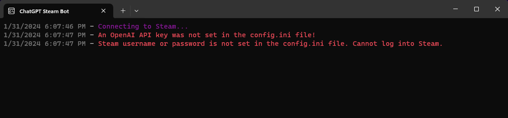
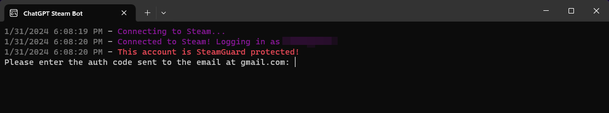

# ChatGPTSteamBot
ChatGPT-powered steam bot

At first, running the project will give errors saying there isn't an API key or Steam login credentials: 

To connect to Steam:

1. Populate the username parameter SteamUsername=PLACEHOLDER in the config.ini file in the project directory with the username you use to log into Steam
2. Populate the password parameter SteamPassword=PLACEHOLDER in the config.ini file in the project directory

To Connect to OpenAI API:

1. To get the OpenAI API interface to work, log into your openAI API page: https://platform.openai.com/docs/overview
2. Create or log into an account
3. In the menu on the left hand side of the screen go down to "API Keys"
4. Press "Create new secret key"
5. Take note of that secret key and populate it into the APIKey=PLACEHOLDER parameter in the config.ini file

With the config.ini file filled out run HelpBot.exe to run the bot. More settings can be adjusted in the ini file to get the functionality you want. 

If the steam credentials provided have MFA or mobile authenticator set up, youll be asked to provide the code in the console: 

